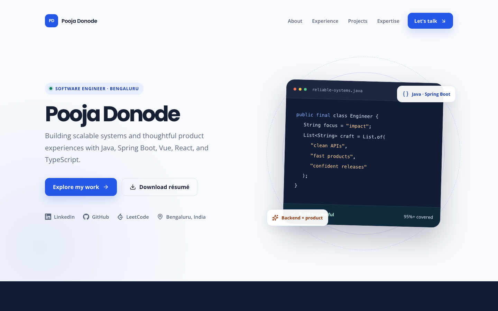
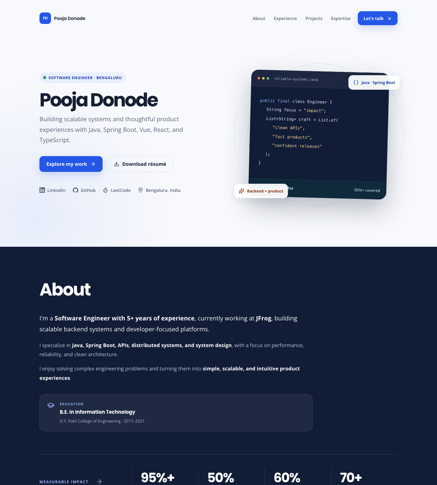

# Pooja Donode — Portfolio

Personal site for [Pooja Donode](https://www.linkedin.com/in/pooja-donode-948b49244), Software Engineer.

**Live site:** [https://poojadonode28.github.io/pooja-portfolio/](https://poojadonode28.github.io/pooja-portfolio/)

[](https://poojadonode28.github.io/pooja-portfolio/)



## Stack

React 19 + TypeScript, built with Vite. Styling is hand-written CSS with semantic
design tokens; icons come from `lucide-react` (UI) and `simple-icons` (brand marks).

## Commands

```bash
npm install     # install dependencies
npm run dev     # start the dev server
npm test        # run the Vitest suite
npm run build   # type-check and build to dist/
npm run preview # preview the production build
```

## Deployment

The site is published to GitHub Pages on every push to `main`:

[https://poojadonode28.github.io/pooja-portfolio/](https://poojadonode28.github.io/pooja-portfolio/)

`.github/workflows/deploy.yml` runs the tests and publishes `dist/`. Pages is
configured to build with **GitHub Actions**.

The Vite `base` defaults to `/pooja-portfolio/` so assets resolve under the
repository subpath. To deploy on a host that serves from the domain root instead
(Vercel, Netlify, a custom domain), build with `BASE_PATH=/`:

```bash
BASE_PATH=/ npm run build
```

The résumé link is derived from `import.meta.env.BASE_URL`, so it follows whichever
base you build with.

## Content

Résumé content (roles, projects, skills, contact details) lives in `src/content.ts`.
Editing that file is enough to update the site — the layout reads from it.
The downloadable résumé PDF is `public/pooja-donode-resume.pdf`.
